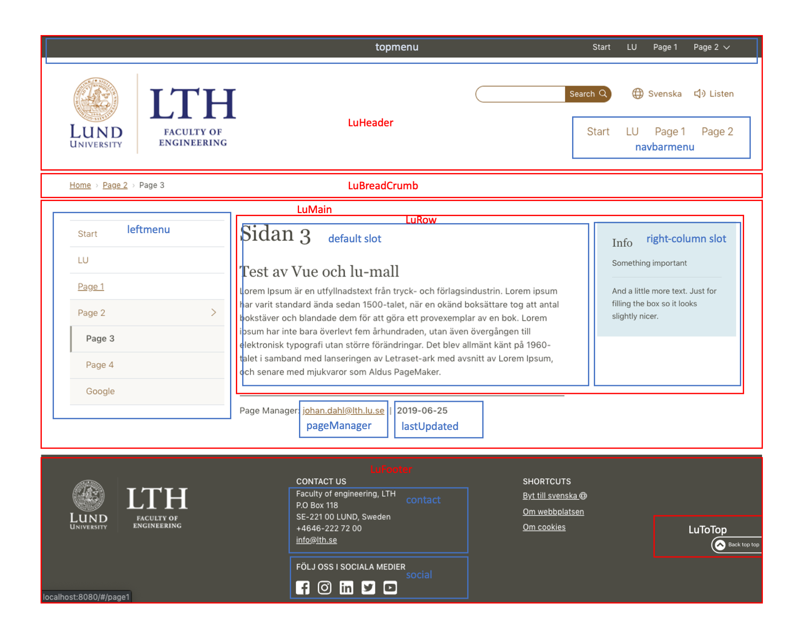

# Vue components for LU web template

This is the source for the node module @lu.se/vue-template https://www.npmjs.com/package/@lu.se/vue-template
For an example using this module see https://github.com/johandalabacka/vue-template-test




## Example

App.vue
```js
<template>
  <div>
    <lu-nav-mobile :menu="menu"/>
    <lu-header :navbarmenu="menu" :topmenu="menu" has-listen/>

    <!-- key is hack to redraw component then locale changes -->
    <lu-bread-crumb :key="$i18n.locale"/>

    <lu-main :leftmenu="menu" lastUpdated="2019-06-25" pageManagerMail="john.doe@lth.lu.se">
          <router-view/>
    </lu-main>
    <lu-footer
      :contact="{name: $t('lthFull'), box: '118', zip: '221 00', phone: '046-222 72 00', mail: 'info@lth.se'}"
      :socialMedia="{
        facebook: 'https://www.facebook.com/lundstekniskahogskola',
        linkedin: 'https://www.linkedin.com/school/lunds-tekniska-högskola',
        instagram: 'https://www.instagram.com/lth_lunduniversity',
        twitter: 'https://twitter.com/lthinfo',
        youtube: 'https://www.youtube.com/user/LunduniversityLTH/featured'
        }"/>
  </div>
</template>

<script>
import LuNavMobile from '@lu.se/vue-template/LuNavMobile'
import LuHeader from '@lu.se/vue-template/LuHeader'
import LuBreadCrumb from '@lu.se/vue-template/LuBreadCrumb'
import LuMain from '@lu.se/vue-template/LuMain'
import LuFooter from '@lu.se/vue-template/LuFooter'

import menu from './menu.js'

export default {
  name: 'App',
  data () {
    return {
      menu: []
    }
  },
  components: {
    LuNavMobile,
    LuHeader,
    LuBreadCrumb,
    LuMain,
    LuFooter
  },
  mounted () {
    this.menu = menu
  },
  i18n: {
    messages: {
      sv: {
        lthFull: 'Lunds Tekniska Högskola, LTH'
      },
      en: {
        lthFull: 'Faculty of engineering, LTH'
      }
    }
  }
}
</script>
```


## Components

LuNavMobile, LuHeader, LuBredCrumb, LuMain, LuFooter is to be at toplevel in your app.
The other components are used by them and you don't need to import them.

### LuNavMobile


#### props
This is the menu that will be shown on mobile or narrow windows
Name|Description|Default value
----|-----------|-------------
menu | hamburgermenu. If not set, will the menu not show| undefined


### LuHeader

This is the header of the page containing logo, search field, language switcher.
Optional menus one on the top and one below logo and search field.

#### props

Name|Description|Default value
----|-----------|-------------
topmenu | menu on top of the page. If not set, will the menu not show| undefined
navbarmenu | menu below header. If not set, will the menu not show| undefined
hasListen | should page use browsealoud | false


### LuBreadCrumb

Uses router to create a bredcrump of current and all parent pages. This component is optional.
It uses no props and takes all information from the router.

### LuMain

#### props

Name|Description|Default value
----|-----------|-------------
leftmenu | Menu to the left. If not set will the menu not show | undefined
lastUpdated | Date of last update | undefined
pageManagerMail | Mail address of page manager | undefined

#### slots

Name|Description
----|-----------
default | content of page

### LuFooter

#### props

Name|Description|Default value
----|-----------|-------------
contact | Object with the following properties name, box (number), zip, phone and mail | undefined
socialMedia | object with possible attributes. null if not shown {facebook: "https://facebook...", instagram: ..., linkedin: twitter: ..., youtube: ... } | undefined
    

## Menu example

```javascript
export default [{
  id: 'start',
  label: 'Start',
  path: '/'
},
{
  id: 'lu',
  label: 'LU',
  url: 'http://www.lu.se'
},
{
  id: 'page1',
  label: 'Page 1',
  path: '/page1'
},
{
  id: 'page2',
  label: 'Page 2',
  path: '/page2',
  children: [{
    id: 'page3',
    label: 'Page 3',
    path: '/page2/page3'
  },
  {
    id: 'page4',
    label: 'Page 4',
    path: '/page2/page4'
  },
  {
    id: 'google',
    label: 'Google',
    url: 'https://www.google.com'
  }]
}]
```

All items in menu should have a unique id, a label and a path (internal page) or url (external page).

## How-to

To use it in a project

### Install
yarn add '@lu.se/vue-template' or
npm add '@lu.se/vue-template'

### Install lu-template
Download https://samwebb.lu.se/bundle.zip unpack it and rename folder to lumall and put it in the same folder as index.html (public)

### index.html

```html
<!DOCTYPE html>
<html lang="sv">

<head>
  <meta charset="utf-8">
  <meta http-equiv="x-ua-compatible" content="ie=edge">
  <meta name="viewport" content="width=device-width, initial-scale=1">
  <title>Article Page: Default | Lunds universitet</title>
  <link media="all" rel="stylesheet" href="./lumall/styles/main.css">
  <link rel="apple-touch-icon" sizes="180x180" href="./lumall/apple-touch-icon.png">
  <link rel="icon" type="image/png" sizes="32x32" href="./lumall/favicon-32x32.png">
  <link rel="icon" type="image/png" sizes="16x16" href="./lumall/favicon-16x16.png">
  <link rel="manifest" href="./lumall/site.webmanifest">
  <link rel="mask-icon" href="./lumall/safari-pinned-tab.svg" color="#875e29">
  <meta name="msapplication-TileColor" content="#875e29">
  <meta name="theme-color" content="#875e29">
</head>

<body>
  <div id="app"></div>

  <script src="./lumall/scripts/bootstrap.js" defer></script>
  <script src="./lumall/scripts/main.js" defer></script>
  <script src="./lumall/scripts/fontawesome.js" defer></script>
</body>
</html>


```