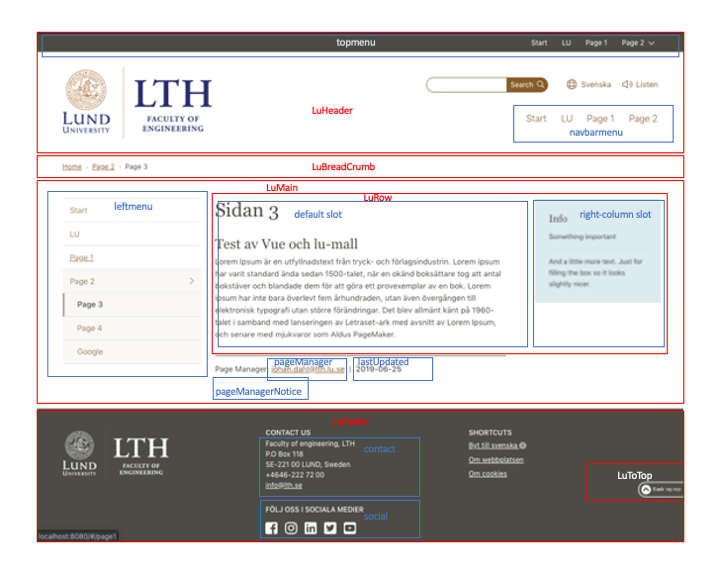

# Vue components for LU web template

This is the source for the node module [@lu.se/vue-template](https://www.npmjs.com/package/@lu.se/vue-template)
For an example using this module see [johandalabacka/vue-template-test](https://github.com/johandalabacka/vue-template-test).



> **NOTE (_October 2025_)**: This package was rewritten to use Vue's (and vue-i18n's use of) [Composition API](https://vuejs.org/guide/extras/composition-api-faq.html) in version 3.2.0. If you need to use the [legacy](https://vue-i18n.intlify.dev/guide/migration/breaking11.html) approach with the Options API you need use <=[v3.1.5](https://github.com/johandalabacka/lu.se-vue-template/commit/fa8aa4721cb01db642127f453417bf6eba6129b2).

## Example

`App.vue` (from [vue-template-test](https://github.com/johandalabacka/vue-template-test/tree/master/src/App.vue))
```html
<template>
  <LuHeader
    :navbarmenu="menu"
    :topmenu="menu"
    :mobilemenu="menu"
    has-login
    has-search
    empty-search
    :is-logged-in="isLoggedIn"
    avatar="JD"
    logo-url="https://www.lth.se"
    :logo-src="`${baseUrl}lumall/images/logo/lth_logo_${locale}.svg`"
    :logo-title="t('lth_full')"
    compact
    @login="login"
    @logout="logout"
  />

  <!-- key is hack to redraw component then locale changes -->
  <LuBreadCrumb
    v-if="true"
    :key="locale"
  />

  <LuMain
    :leftmenu="menu"
    compact
    last-updated="2021-11-30"
    :page-manager-mail="t('page_manager')"
    :page-manager-notice="t('mail_only_for_support')"
  >
    <router-view />
  </LuMain>
  <LuToTop />
  <LuFooter
    :contact="{ name: t('lth_full'), box: '118', zip: '221 00', phone: '046-222 72 00', mail: 'info@lth.se' }"
    :logo-src="`${baseUrl}lumall/images/logo/lth_logo_footer_${locale}.svg`"
    :logo-title="t('lth_full')"
    :short-cuts="menu"
  />
</template>

<script setup>
import { computed, ref } from 'vue'
import { useI18n } from 'vue-i18n'
import '@lu.se/vue-template/icons'
import { LuHeader, LuBreadCrumb, LuMain, LuFooter, LuToTop } from '@lu.se/vue-template/index.js'

import menuData from './menu.js'

const baseUrl = import.meta.env.BASE_URL
const isLoggedIn = ref(false)

const login = function() {
  isLoggedIn.value = true
}

const logout = function() {
  isLoggedIn.value = false
}

const menu = computed(() => menuData)
const { t, locale } = useI18n()
</script>
```

## i18n Setup

All components use [vue-i18n](https://vue-i18n.intlify.dev/) for [internationalization](https://www.wikiwand.com/en/articles/Internationalization_and_localization).
The package's internationalization (i18n) strings need to be merged into your application's vue-i18n instance. 

> **Details**: In order to not pollute your app's set of i18n strings more than necessary, all string keys from this package are prefixed with `luvt` (for _Lund University Vue template_). E.g. the full slug for the header's login string is: `luvt.header.login`.

To merge this package's i18n strings and your application's, there are two ways:

1. Automatically merge through a [Vue plugin](https://vuejs.org/guide/reusability/plugins) defined by this package.
2. Do the merging manually yourself.

### Approach #1: Vue plugin
For this approach you basically only need to add two lines:

```js
import luTemplate from '@lu.se/vue-template'
// ...
app.use(luTemplate, i18n)
```

From `main.js` (from [vue-template-test](https://github.com/johandalabacka/vue-template-test/tree/master/src/main.js)), a demo app to show how to use this package:

```html
<script setup>
import { createApp } from 'vue'
import App from './App.vue'
// ...
import { createI18n } from 'vue-i18n'
import luTemplate from '@lu.se/vue-template'

// ...

// Your own translations
import en from './locales/en.json'
import sv from './locales/sv.json'

const messages = {
  sv,
  en,
}

const i18n = createI18n({
  locale: useLocalStorage('language', 'sv').value,
  fallbackLocale: 'sv',
  legacy: false,
  allowComposition: true,
  mode: 'composition',
  messages,
  // ...
})

const app = createApp(App)
app.use(i18n)
app.use(luTemplate, i18n) // note: needs to come after i18n line
// ...
</script>
```

### Approach #2: manual merging

If you want to have more control the package exports a `messages` object containing all translation strings used by the components. You can then merge these messages with your application's i18n configuration like this:

Using `main.js` (from [vue-template-test](https://github.com/johandalabacka/vue-template-test/tree/master/src/main.js)) again as an example:
```html
<script setup>
import { createApp } from 'vue'
import App from './App.vue'
// ...
import { createI18n } from 'vue-i18n'
import { messages as lumallMessages } from '@lu.se/vue-template'

// ...

// Your own translations
import localeEn from './locales/en.json'
import localeSv from './locales/sv.json'

// Merge this package's i18n strings with your own:
const messages = {
  sv: {
    ...lumallMessages.sv,
    ...localeSv, 
  },
  en: {
    ...lumallMessages.en,
    ...localeEn,
  },
}

const i18n = createI18n({
  locale: useLocalStorage('language', 'sv').value,
  fallbackLocale: 'sv',
  legacy: false,
  allowComposition: true,
  mode: 'composition',
  messages,
  // ...
})

const app = createApp(App)
app.use(i18n)
// note: no need to use the `app.use` statement from approach #1 here
// ...
</script>
```

### Translation Keys

There exists translations for [Swedish](./locales/sv.json) (sv) and [English](./locales/en.json) (en). The locale specification format used in this package is [ISO 639](https://www.wikiwand.com/en/articles/ISO_639).

> _Recap from above_: in order to not pollute your app's set of i18n strings more than necessary, all string keys from this package are prefixed with `luvt` (for _Lund University Vue template_). _\[..\]_

The translation keys are thus generally in this format:
```xml
luvt.<component>.<slug>
```

E.g. for the [`LuHeader`](./LuHeader.vue) component:

#### Header Component

- `luvt.header.menu` - Menu button label
- `luvt.header.search` - Search button/field label
- `luvt.header.showHideSearch` - Accessibility label for search toggle
- ...

#### ToTop Component

Some components only have one string and are thus only named with the slug:

- `luvt.to_top` - Back to top button label

## Components

**LuHeader**, **LuBreadCrumb**, **LuMain**, **LuFooter** is to be at top level in your app.
The other components are used by them and you don't need to import them.

### [LuHeader](./LuHeader.vue)

This is the header of the page containing logo, search field, language switcher.
Optional menus one on the top and one below logo and search field.
Language switcher sets the key language in local storage to *sv* or *en*.

#### props

Name | Description | Default value
----|-----------|-------------
`topmenu` | menu on top of the page. If not set, the menu will not show | undefined
`navbarmenu` | menu below header. If not set, the menu will not show| undefined
`mobilemenu` | menu shown on mobile narrow pages | false
`hasLogin` | A login/logout button is added | false
`isLoggedIn` | Is user logged in (show login or logout) | false
`avatar` | show first two letters of string instead of logout icon | ''
`hasSearch` | A search field is added | false
`emptySearch` | Search field is emptied after search | false
`searchPlaceholder` | Placeholder for search field | ''
`logoSrc` | URL for the image | ''
`logoTitle` | title and alt text | ''
`logoUrl` | URL then clicking the logo  | ''
`compact` | Less padding on height | false

### events

Name|Payload|Description
----|-----------|-------------
`@login` | -- | User has clicked log in
`@logout` | -- | User has clicked log out
`@search` | "search string" | User has made a search

### [LuBreadCrumb](./LuBreadCrumb.vue)

Uses `router` to create a breadcrump of current and all parent pages. This component is optional.
It uses no props and takes all information from the router.

### [LuMain](./LuMain.vue)

#### props

Name | Description | Default value
----|-----------|-------------
`leftmenu` | Menu to the left. If not set will the menu not show and content will use the whole width. | null
`lastUpdated` | Date of last update | ''
`pageManagerMail` | Mail address of page manager | ''
`pageManagerNotice` | Notice under the page manager / date | ''
`compact` | Less padding on top | false

#### slots

Name | Description
----|-----------
`default` | content of page

### [LuRow](./LuRow.vue)

A row with space for an optional right column. Is used inside LuMain. You can have several rows stacked on each other.

#### slots

Name | Description
----|-----------
`default` | central content
`right-column` | content to the right. Goes below default content on smaller screens.

### [LuFooter](./LuFooter.vue)

#### props

Name | Description | Default value
----|-----------|-------------
`contact` | Object with the following properties name, box (number), zip, phone and mail | null
`logoSrc` | URL for the image | ''
`logoTitle` | title and alt text | ''
`shortCuts` | menu of shortcuts. Always contains `t('luvt.footer.shortcuts')`. | null


### [LuInfobox](./LuInfobox.vue)

A box which is usually inside the right-column slot of a LuRow.

#### props

Name | Description | Default value
----|-----------|-------------
`title` | The title of the box, _required prop_ | undefined

#### slots

Name | Description
----|-----------
`default` | content of the box

### [LuSpinner](./LuSpinner.vue)

A loading/waiting spinner.

#### props

Name | Description | Default value
----|-----------|-------------
`text` | text to show | `t('luvt.spinner.loading')`

### [LuToTop](./LuToTop.vue)

A button which is shown if page is scrolled a bit down `(pageYOffset > 500)`.
No props or events.

## [Menu](https://github.com/johandalabacka/vue-template-test/tree/master/src/menu.js) example

`path` are [vue-router](https://router.vuejs.org/) paths and `url` are ordinary `a` href:s.

```javascript
export default [{
  id: 'start',
  label: 'start',
  path: '/',
},
{
  id: 'lu',
  label: 'lu',
  url: 'http://www.lu.se',
},
{
  id: 'admin',
  label: 'admin',
  children: [
    {
      id: 'page1',
      label: 'page1',
      path: '/page1',
    },
  ],
},
{
  id: 'page2',
  label: 'page2',
  path: '/page2',
  children: [{
    id: 'page3',
    label: 'page3',
    path: '/page2/page3',
  },
  {
    id: 'page4',
    label: 'page4',
    path: '/page2/page4',
  },
  {
    id: 'google',
    label: 'google',
    url: 'https://www.google.com',
  }],
}]
```

All items in menu should have a unique id, a label and a path (internal page) or url (external page).
In the router definition, if `meta.title` for a route is defined that is used as the title of page instead of the route's name.

## How-to

To use it in a project

### Install

E.g. with npm:

```bash
npm add '@lu.se/vue-template'
```

### Install lu-template

Get a hold of the LU webmall (unfortunately not publically available anymore), unpack it and rename the folder to `lumall` and put it in the `public` folder.

### [index.html](https://github.com/johandalabacka/vue-template-test/tree/master/index.html)

```html
<!DOCTYPE html>
<html lang="sv">

<head>
  <meta charset="utf-8">
  <meta http-equiv="x-ua-compatible" content="ie=edge">
  <meta name="viewport" content="width=device-width, initial-scale=1">
  <title>Article Page: Default | Lunds universitet</title>
  <link media="all" rel="stylesheet" href="./lumall/styles/main.css">
  <link rel="apple-touch-icon" sizes="180x180" href="./lumall/apple-touch-icon.png">
  <link rel="icon" type="image/png" sizes="32x32" href="/lumall/favicon-32x32.png">
  <link rel="icon" type="image/png" sizes="16x16" href="/lumall/favicon-16x16.png">
  <link rel="manifest" href="./lumall/site.webmanifest">
  <link rel="mask-icon" href="./lumall/safari-pinned-tab.svg" color="#875e29">
  <meta name="msapplication-TileColor" content="#875e29">
  <meta name="theme-color" content="#875e29">
</head>

<body>
  <div id="app"></div>
  <script type="module" src="/src/main.js"></script>
</body>

</html>
```